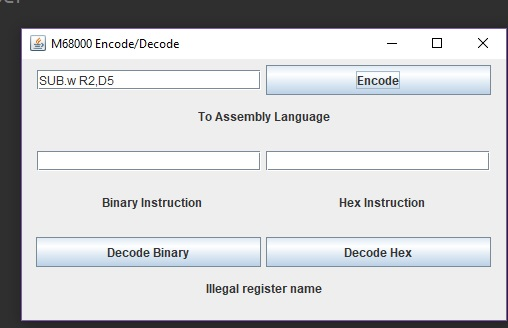
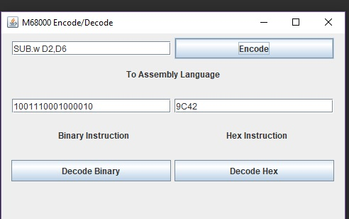
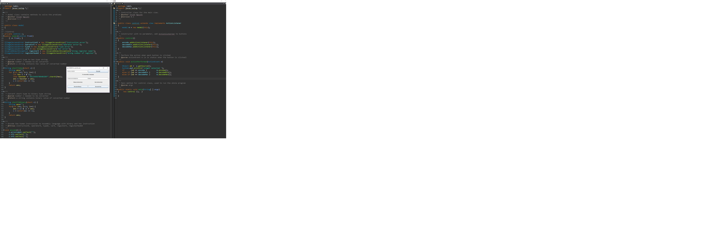

# M6800MachineInstructions
The Motorola 68000 family of CPUs is a Complex Instruction Set Computer (CISC).

### Goal
Practice using MVC in Java to create applications.

### ASSIGNMENT
Write a Java application with a graphical user interface that allows a user to encode and
decode M68000 instructions. The program must provide the following functionalities
- Conversions should be done from Assembler Mnemonics to Assembler Code
and vice versa.
- Upper and lowercase are accepted and represent the same instruction
- Generate the message of errors if the input cannot be translated
(i.e. encoded/decoded)
- Display JTextFields with the instructions encoded in both binary
and hexadecimal during session should be provided
- Exception handling for checked and unchecked exceptions must be provided
- The facility to read/save text files using either FileDialog or JFileChooser
should be provided

### Screenshot

### License
This project is licensed under the MIT License - see the LICENSE.md file for details
